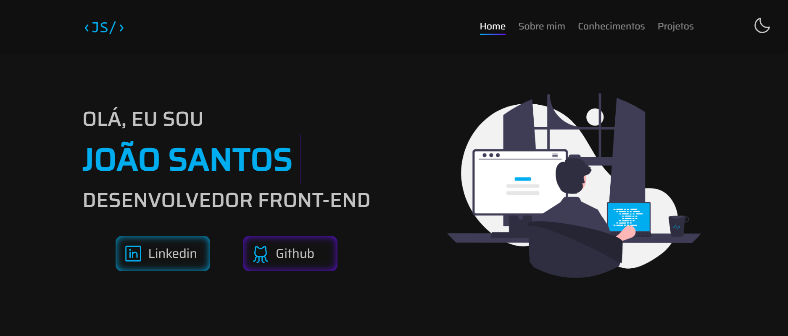

<h1 align="center">
  Portifolio 🌐
</h1>

<p align="center">
  <a href="#-sobre-o-projeto">Projeto</a>&nbsp;&nbsp;&nbsp;|&nbsp;&nbsp;&nbsp;
  <a href="#-conceitos-utilizados-no-desenvolvimento">Conceitos</a>&nbsp;&nbsp;&nbsp;|&nbsp;&nbsp;&nbsp;
  <a href="#-tecnologias-utilizadas">Tecnologias</a>&nbsp;&nbsp;&nbsp;|&nbsp;&nbsp;&nbsp;
  <a href="#-como-executar-o-projeto">Executar o projeto</a>&nbsp;&nbsp;&nbsp;|&nbsp;&nbsp;&nbsp;
  <a href="#-licença">Licença</a>
</p>

# 🚧 Sobre o projeto

Preview: https://portifolio-joaosam.vercel.app/

Meu portifolio. A ideia desse projeto é mostrar um pouco sobre minha pessoa quanto desenvolvedor, além de exibir na prática algumas ferramentas, frameworks que já utilizo diariamente e também adicionando novas tecnologias. Nesse projeto me atentei mais aos testes utilizando o Jest com o react-testing-library para testes unitários e o Cypress para testes e2e.

## 🛠️ Funcionalidades

- Troca tema e salva no local Storage
- Exibe detalhes das tecnologias mencionadas no projeto
- Consumo de API do github com o React-query
- Atualiza os projetos novos projetos caso seja adicionado novos repositórios no github
- Responsivo para versões mobile

# 📚 Conceitos Utilizados no Desenvolvimento

- Hooks do react como UseState e UseEffect
- Tipagem no código, mitigando ao máximo erros no código
- Código fortemente testado com coverage de 100% nos testes unitários
- Clean code

## 🎨 Layout



# 🚀 Tecnologias utilizadas

- TypeScript
- ReactJS
- Styled Components
- Jest
- Cypress

# 💻 Como executar o projeto

Pré-requisitos: npm / yarn

```bash
# Clonar repositório
git clone https://github.com/Joaosam/Portifolio.git

# Navegar até a pasta
cd Portifolio

# Instalar dependências
npm install

# Executar o projeto
npm run dev
```

## 📝 Licença

Esse projeto está sob a licença MIT. Veja o arquivo [LICENSE](LICENSE) para mais detalhes.
[](hhttps://github.com/Joaosam/Portifolio/blob/main/LICENSE)

<br />

---

Feito com ♥ by Joaosam
